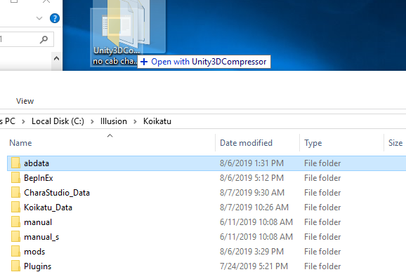
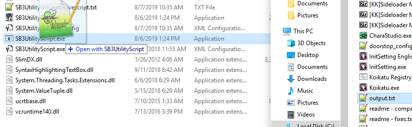

# Unity assetbundle compression script creator

This program will generate scripts for use in SB3Utility that will compress unity3d files.
Compressed unity3d files will function just as normal except take up less space on disk.
After compressing the abdata folder in Koikatsu, the file size was reduced from 21.2GB to 12.1GB.

You will need SB3Utility 1.18.1 or greater, for AI Girl you will need 1.19.3 or greater.

To use this program, drag a folder or a unity3d file on to the .exe

This will create a output.txt file in the same folder as the folders or files you dragged.
Next, take that output.txt and drag it on to SB3UtilityScript.exe, which comes as part of [SB3Utility](https://github.com/enimaroah/SB3Utility/releases).

A window will pop up. Occasionally it will display messages like "Invalid container entry for...", these are just informational and do not indicate an error.
It will take several minutes to compress the entire folder, and you want to make sure your game isn't running during this time.
When the window closes, compression is complete.

The scripts generated by this program can be run on any game that uses unity3d asset bundles, provided SB3Utility supports that Unity version.
I was able to compress EmotionCreators abdata folder from 8.51GB to 2.57GB and HoneySelect abdata from 17.8GB to 12.4GB.

Thanks to enimaroah for his continual improvements to SB3Utility which has made this possible!
